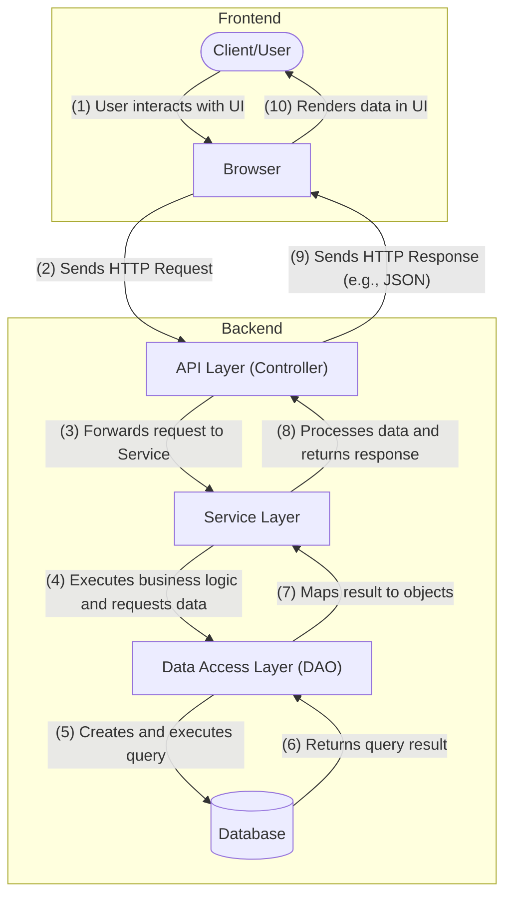

This article provides a comprehensive guide on how to set up and run a simple Spring Boot project from scratch, covering essential steps such as environment setup, project creation, dependency management, application configuration, and running the application.

## What is Spring Boot?

Spring Boot is an open-source framework based on the Spring Framework, designed to simplify the bootstrapping and development of new Spring applications. It follows the "convention over configuration" paradigm to reduce developer effort, making it faster, more convenient, and more efficient to develop Spring applications.

### Key Features

1.  **Simplified Configuration**
    *   It follows the "convention over configuration" principle, simplifying project setup through auto-configuration and starter dependencies, allowing developers to quickly build a runnable Spring application.

2.  **Highly Integrated**
    *   It provides numerous out-of-the-box features like embedded servlet containers (Tomcat, Jetty, or Undertow), health checks, and metrics monitoring. It also integrates with many popular libraries and frameworks like Spring Data and Spring Security.

3.  **Microservices Support**
    *   Spring Boot is well-suited for building microservice architectures. Through Spring Cloud, it offers extensive support, integrating features like service discovery, a configuration center, and load balancing.

4.  **Embedded Server**
    *   It can package the application into an executable JAR file with an embedded servlet container. Developers can run the application with a simple `java -jar` command without needing to deploy it to an external web server.

5.  **Rich Ecosystem**
    *   Thanks to its widespread adoption and powerful ecosystem, developers can easily use various extensions and plugins like Actuator and Spring Boot DevTools to improve development efficiency and application quality.

## Project Structure and Data Flow


The diagram above illustrates the typical architecture of a modern web application, which this project follows. The structure is divided into a frontend and a backend, with data flowing between them in a well-defined manner as numbered in the diagram.

### Backend Layers

The backend is composed of several distinct layers, each with a specific responsibility:

#### API Layer (Controller)

This is the entry point for all incoming requests from the frontend (steps 2 & 9). It's responsible for exposing endpoints (URLs), handling HTTP requests/responses, and calling the appropriate service layer methods. This layer implements a RESTful API, which follows standard conventions for web services.

##### RESTful API Conventions

*   **Paths (Endpoints)**: In a RESTful architecture, each URL represents a resource. Paths should contain nouns that correspond to the application's resources (e.g., `/users`, `/orders`), not verbs. These nouns often align with database table names.

> REST (Representational State Transfer) is an architectural style for designing networked applications.
> It's not a strict protocol but a set of constraints that, when followed, enable scalable and easy-to-use web services.
> The core idea is to treat server-side resources as objects that can be manipulated using standard HTTP methods.
{: .prompt-info}

*   **HTTP Verbs**: Specific actions on these resources are defined by the HTTP method used in the request:
    *   `GET` (SELECT): Retrieve one or more resources from the server.
    *   `POST` (CREATE): Create a new resource on the server.
    *   `PUT` (UPDATE): Update a resource on the server (by providing the complete resource).
    *   `PATCH` (UPDATE): Partially update a resource on the server (by providing only the changed attributes).
    *   `DELETE` (DELETE): Remove a resource from the server.

#### Service Layer

This layer contains the core business logic of the application (steps 3 & 8). It's responsible for orchestrating operations by calling methods on the Data Access Layer and implementing complex business rules. It is decoupled from the web layer, meaning it doesn't know about HTTP requests or responses.

#### Data Access Layer (Repository)

This layer is responsible for all communication with the database (steps 4, 5, 6, & 7). Its tasks include performing CRUD (Create, Read, Update, Delete) operations and translating business objects from the service layer into database rows and vice-versa. In Spring Boot, this is often implemented using Spring Data JPA.

> Spring Data JPA is a part of the larger Spring Data family that aims to significantly simplify the implementation of data access layers. 
> It builds on top of the Java Persistence API (JPA) standard. 
> Its key feature is the ability to create repository implementations automatically, at runtime, from a repository interface. 
> This means developers don't have to write boilerplate code for standard CRUD operations, freeing them to focus on business-specific queries.
{: .prompt-info}

#### Database

This is the **persistence layer** where the application's data is stored and managed.

> **Persistence** refers to the process of storing data in a non-volatile storage medium (like a hard disk), so that the data "persists" and remains available even after the application that created it has shut down. 
> The database is the component responsible for ensuring the durability and integrity of the application's data.
{: .prompt-info}


## Building the Student CRUD Application

This section provides a step-by-step guide to implementing a full CRUD (Create, Read, Update, Delete) functionality for a `Student` entity. We will build the application from the database layer up to the API endpoint.

The implementation is divided into three main parts, following the application architecture:

1.  **Data Access Layer**: Setting up the database, entity, and repository.
2.  **Service Layer**: Implementing the core business logic.
3.  **Controller Layer**: Exposing the functionality through RESTful API endpoints.

### 1. Data Access Layer: The Foundation

#### 1.1 Database Setup

| Attribute (Java) | Column (SQL)      | Data Type (Java / SQL) | Description                                                               |
| :--------------- | :---------------- | :--------------------- | :------------------------------------------------------------------------ |
| `id`             | `id`              | `Long` / `BIGINT`      | **Primary Key**. A unique identifier for each student. Auto-incrementing. |
| `firstName`      | `first_name`      | `String` / `VARCHAR`   | The student's first name. Should not be null.                             |
| `lastName`       | `last_name`       | `String` / `VARCHAR`   | The student's last name. Should not be null.                              |
| `email`          | `email`           | `String` / `VARCHAR`   | The student's email address. Should be **unique**.                        |
| `major`          | `major`           | `String` / `VARCHAR`   | The student's major or field of study.                                    |
| `enrollmentDate` | `enrollment_date` | `LocalDate` / `DATE`   | The date the student enrolled.                                            |

#### 1.2 Entity Class

```java
import jakarta.persistence.*;
import java.time.LocalDate;

@Entity
@Table(name = "students")
public class Student {

    @Id
    @GeneratedValue(strategy = GenerationType.IDENTITY)
    private Long id;

    @Column(name = "first_name", nullable = false)
    private String firstName;

    @Column(name = "last_name", nullable = false)
    private String lastName;

    @Column(name = "email", nullable = false, unique = true)
    private String email;

    @Column(name = "major")
    private String major;

    @Column(name = "enrollment_date")
    private LocalDate enrollmentDate;

}
```


### 2. Service Layer: Business Logic

### 3. Controller Layer: API Endpoints
