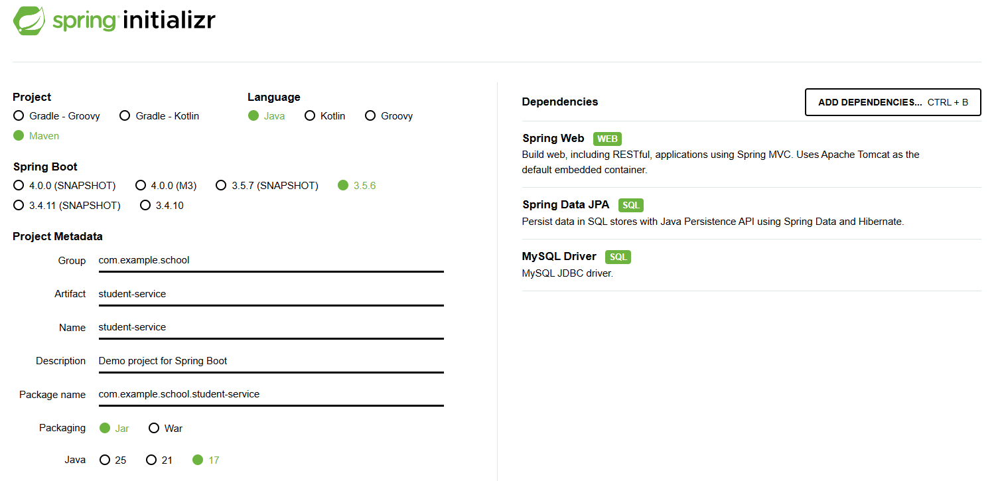
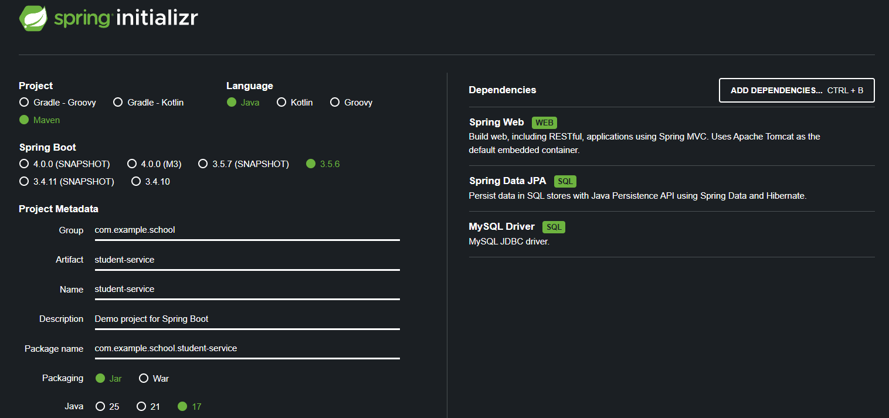

This article provides a comprehensive guide on how to set up and run a simple Spring Boot project from scratch, covering essential steps such as environment setup, project creation, dependency management, application configuration, and running the application.

## What is Spring Boot?

Spring Boot is a framework that lets you build production-ready Spring applications quickly with minimal setup. It supplies opinionated defaults, starter dependencies, and runtime auto-configuration so you can focus on business logic instead of infrastructure.

### Key Features
1. Auto-Configuration: Wires common components based on the classpath.
2. Starters: Bundled dependencies reduce manual version management.
3. Embedded Server: Run directly as a standalone JAR (Tomcat/Jetty/Undertow).
4. Actuator: Built-in endpoints for health, metrics, and monitoring.
5. Microservice Ready: Integrates easily with Spring Cloud (config, discovery, resilience).

## Project Structure and Data Flow


The diagram above illustrates the typical architecture of a modern web application, which this project follows. The structure is divided into a frontend and a backend, with data flowing between them in a well-defined manner as numbered in the diagram.

### Backend Layers

The backend is composed of several distinct layers, each with a specific responsibility:

#### API Layer (Controller)

This is the entry point for all incoming requests from the frontend (steps 2 & 9). It's responsible for exposing endpoints (URLs), handling HTTP requests/responses, and calling the appropriate service layer methods. This layer implements a RESTful API, which follows standard conventions for web services.

##### RESTful API Conventions

*   **Paths (Endpoints)**: In a RESTful architecture, each URL represents a resource. Paths should contain nouns that correspond to the application's resources (e.g., `/users`, `/orders`), not verbs. These nouns often align with database table names.

> REST (Representational State Transfer) is an architectural style for designing networked applications.
> It's not a strict protocol but a set of constraints that, when followed, enable scalable and easy-to-use web services.
> The core idea is to treat server-side resources as objects that can be manipulated using standard HTTP methods.
{: .prompt-info}

*   **HTTP Verbs**: Specific actions on these resources are defined by the HTTP method used in the request:
    *   `GET` (SELECT): Retrieve one or more resources from the server.
    *   `POST` (CREATE): Create a new resource on the server.
    *   `PUT` (UPDATE): Update a resource on the server (by providing the complete resource).
    *   `PATCH` (UPDATE): Partially update a resource on the server (by providing only the changed attributes).
    *   `DELETE` (DELETE): Remove a resource from the server.

#### Service Layer

This layer contains the core business logic of the application (steps 3 & 8). It's responsible for orchestrating operations by calling methods on the Data Access Layer and implementing complex business rules. It is decoupled from the web layer, meaning it doesn't know about HTTP requests or responses.

#### Data Access Layer (Repository)

This layer is responsible for all communication with the database (steps 4, 5, 6, & 7). Its tasks include performing CRUD (Create, Read, Update, Delete) operations and translating business objects from the service layer into database rows and vice-versa. In Spring Boot, this is often implemented using Spring Data JPA.

> Spring Data JPA is a part of the larger Spring Data family that aims to significantly simplify the implementation of data access layers. 
> It builds on top of the Java Persistence API (JPA) standard. 
> Its key feature is the ability to create repository implementations automatically, at runtime, from a repository interface. 
> This means developers don't have to write boilerplate code for standard CRUD operations, freeing them to focus on business-specific queries.
{: .prompt-info}

#### Database

This is the **persistence layer** where the application's data is stored and managed.

> **Persistence** refers to the process of storing data in a non-volatile storage medium (like a hard disk), so that the data "persists" and remains available even after the application that created it has shut down. 
> The database is the component responsible for ensuring the durability and integrity of the application's data.
{: .prompt-info}


## Building the Student CRUD Application

This section provides a step-by-step guide to implementing a full CRUD (Create, Read, Update, Delete) functionality for a `Student` entity. We will build the application from the database layer up to the API endpoint.

The implementation is divided into three main parts, following the application architecture:

1.  **Data Access Layer**: Setting up the database, entity, and repository.
2.  **Service Layer**: Implementing the core business logic.
3.  **Controller Layer**: Exposing the functionality through RESTful API endpoints.

### Creating the Spring Boot Project

First, create a Spring Boot project using the [Spring Initializr](https://start.spring.io/) to quickly generate the project skeleton.

> **Official Getting Started Manuals**:  
> Super quick — try the [Quickstart Guide](https://spring.io/quickstart).  
> More general — try [Building an Application with Spring Boot](https://spring.io/guides/gs/rest-service/)
{: .prompt-tip}

{: .light }
{: .dark }

In the initial setup (shown above) we add the dependencies: Spring Web, Spring Data JPA, and MySQL Driver.

#### Dependencies Explained

1. Spring Web  
   - Purpose: Provides Spring MVC for building RESTful HTTP APIs and serving web content.  
      > ***什么是 Spring MVC?***  
      > Spring MVC 是基于 Servlet 的分层 Web 框架，实现了经典的 Model–View–Controller 模式，用于构建基于 HTTP 的同步 Web/REST 应用。  
      >
      > 核心思想：
      > - M(Model): 业务数据与状态（实体、DTO、Form 对象）  
      > - V(View): 展示层（JSP、Thymeleaf、JSON 序列化结果等）  
      > - C(Controller): 接收请求、协调模型与视图、返回结果
      >
      > 与 Spring Boot 关系：  
      > - Spring Boot 在其之上做自动配置，减少 XML/样板配置
      > - 使用 @SpringBootApplication + spring-boot-starter-web 即可开箱运行
      >
      > 典型流程： 客户端请求 -> DispatcherServlet -> HandlerMapping -> Controller 方法 -> 返回 Model/数据 -> ViewResolver 或 HttpMessageConverter -> 响应
      {: .prompt-info}

   - Includes: DispatcherServlet, controllers (@RestController / @Controller), request mapping, Jackson JSON serialization, validation integration.  
   - When Needed: Any time you expose HTTP endpoints.  
   - 用于构建基于 HTTP 的 REST 接口与 Web 层。  

2. Spring Data JPA  
   - Purpose: Simplifies data access using JPA; reduces boilerplate by generating CRUD implementations from repository interfaces.  
   - Features: JpaRepository, query method derivation, pagination & sorting, transactional support, entity mapping integration.  
   - When Needed: You persist relational data via JPA/Hibernate.  
   - 基于 JPA 提供数据访问抽象，自动生成常规数据库操作。  

3. MySQL Driver  
   - Purpose: JDBC (Java Database Connectivity) driver enabling the application to open connections to a MySQL database.  
   - Role: Translates JDBC calls to MySQL protocol; required at runtime (not used directly in code).  
   - Configuration: Set spring.datasource.url / username / password; optionally Hibernate dialect (often auto-detected).  
   - MySQL 的 JDBC 驱动，负责与数据库建立与传输通信。  

> Spring Web + Spring Data JPA + MySQL Driver form the minimal stack for a REST + database CRUD service.
{: .prompt-tip}

### 1. Data Access Layer: The Foundation

#### 1.1 Layer Overview
The Data Access Layer (DAL) handles persistence concerns:
- Defines schema mapping (object ↔ table)
- Encapsulates CRUD via JPA repositories
- Keeps business logic out of entities
- Shields upper layers from SQL/JDBC specifics

Flow: Entity definition -> Repository interface -> Spring Data auto-implementation -> Service layer consumption.

#### 1.2 Schema & Field Mapping
Logical → physical mapping for Student:

| Java Field     | Column          | Type (Java / SQL)     | Notes            |
| -------------- | --------------- | --------------------- | ---------------- |
| id             | id              | Long / BIGINT         | PK, auto         |
| firstName      | first_name      | String / VARCHAR(50)  | NOT NULL         |
| lastName       | last_name       | String / VARCHAR(50)  | NOT NULL         |
| email          | email           | String / VARCHAR(120) | UNIQUE, NOT NULL |
| major          | major           | String / VARCHAR(100) | Nullable         |
| enrollmentDate | enrollment_date | LocalDate / DATE      | Nullable         |
| dateOfBirth    | date_of_birth   | LocalDate / DATE      | Nullable         |
| age            | age             | Integer / INT         | Nullable         |
| active         | active          | Boolean / TINYINT(1)  | Default TRUE     |

> ORM (Object-Relational Mapping) bridges the gap between object-oriented code and relational databases.
> It maps classes to tables, attributes to columns, and manages CRUD operations.
{: .prompt-info}

#### 1.3 Database DDL & Seed Data
```sql
CREATE DATABASE school_db;
USE school_db;

CREATE TABLE students (
  id BIGINT PRIMARY KEY AUTO_INCREMENT,
  first_name VARCHAR(50) NOT NULL,
  last_name VARCHAR(50) NOT NULL,
  email VARCHAR(120) NOT NULL UNIQUE,
  major VARCHAR(100),
  enrollment_date DATE,
  date_of_birth DATE,
  age INT,
  active TINYINT(1) DEFAULT 1
);

-- Sample data (partial shown)
INSERT INTO students (first_name, last_name, email, major, enrollment_date, date_of_birth, age, active) VALUES
('John', 'Doe', 'john.doe1@example.com', 'Computer Science', '2023-09-01', '2003-05-14', 22, 1),
('Jane', 'Smith', 'jane.smith2@example.com', 'Information Systems', '2022-09-01', '2002-11-02', 22, 0),
('Alex', 'Johnson', 'alex.johnson3@example.com', 'Mathematics', '2024-02-15', '2001-02-25', 24, 1),
('Emily', 'Brown', 'emily.brown4@example.com', 'Physics', '2023-01-10', '2004-07-09', 21, 0),
('Michael', 'Davis', 'michael.davis5@example.com', 'Chemistry', '2022-09-01', '2000-12-30', 24, 1),
('Sophia', 'Miller', 'sophia.miller6@example.com', 'Biology', '2025-03-01', '2005-03-18', 20, 0),
('Daniel', 'Wilson', 'daniel.wilson7@example.com', 'Economics', '2022-01-12', '1999-08-12', 26, 1),
('Olivia', 'Moore', 'olivia.moore8@example.com', 'Finance', '2023-09-15', '2002-01-05', 23, 0),
('Liam', 'Taylor', 'liam.taylor9@example.com', 'Business Administration', '2024-09-01', '2003-10-28', 21, 1),
('Ava', 'Anderson', 'ava.anderson10@example.com', 'English', '2023-06-01', '2004-02-17', 21, 0),
('Noah', 'Thomas', 'noah.thomas11@example.com', 'History', '2021-09-01', '1998-06-01', 27, 1),
('Isabella', 'Jackson', 'isabella.jackson12@example.com', 'Psychology', '2024-09-21', '2006-09-21', 19, 0),
('William', 'White', 'william.white13@example.com', 'Sociology', '2023-02-01', '2001-12-11', 23, 1),
('Mia', 'Harris', 'mia.harris14@example.com', 'Philosophy', '2022-03-01', '1999-03-29', 26, 0),
('James', 'Martin', 'james.martin15@example.com', 'Art', '2024-09-01', '2002-07-07', 23, 1),
('Charlotte', 'Thompson', 'charlotte.thompson16@example.com', 'Music', '2023-09-01', '2003-01-30', 22, 0),
('Benjamin', 'Garcia', 'benjamin.garcia17@example.com', 'Data Science', '2020-09-01', '2000-05-05', 25, 1),
('Amelia', 'Martinez', 'amelia.martinez18@example.com', 'Software Engineering', '2019-09-01', '1997-11-19', 27, 0),
('Elijah', 'Robinson', 'elijah.robinson19@example.com', 'Mechanical Engineering', '2024-01-15', '2005-08-08', 20, 1),
('Harper', 'Clark', 'harper.clark20@example.com', 'Electrical Engineering', '2020-09-01', '2001-09-15', 24, 0),
('Lucas', 'Rodriguez', 'lucas.rodriguez21@example.com', 'Civil Engineering', '2019-01-10', '1998-12-03', 26, 1),
('Evelyn', 'Lewis', 'evelyn.lewis22@example.com', 'Architecture', '2023-04-10', '2004-04-22', 21, 0),
('Mason', 'Lee', 'mason.lee23@example.com', 'Environmental Science', '2024-10-01', '2003-11-30', 21, 1),
('Abigail', 'Walker', 'abigail.walker24@example.com', 'Statistics', '2022-11-20', '2002-06-16', 23, 0),
('Logan', 'Hall', 'logan.hall25@example.com', 'Marketing', '2021-09-01', '1999-10-10', 25, 1),
('Ella', 'Allen', 'ella.allen26@example.com', 'Accounting', '2020-01-20', '2000-01-01', 25, 0),
('Jacob', 'Young', 'jacob.young27@example.com', 'Political Science', '2025-02-10', '2005-12-25', 19, 1),
('Avery', 'Hernandez', 'avery.hernandez28@example.com', 'Linguistics', '2023-09-09', '2004-09-09', 21, 0),
('Carter', 'King', 'carter.king29@example.com', 'Education', '2024-03-03', '2003-03-03', 22, 1),
('Grace', 'Wright', 'grace.wright30@example.com', 'Nursing', '2019-07-01', '2001-07-20', 24, 0);
```

#### 1.4 Entity Class (Student)
`src/main/java/com/example/school/student_service/dao/Student.java`{: .filepath}
```java
package com.example.school.student_service.dao;

import jakarta.persistence.*;
import java.time.LocalDate;

@Entity
@Table(name = "students")
public class Student {

    @Id
    @GeneratedValue(strategy = GenerationType.IDENTITY)
    private Long id;

    @Column(name = "first_name", nullable = false, length = 50)
    private String firstName;

    @Column(name = "last_name", nullable = false, length = 50)
    private String lastName;

    @Column(name = "email", nullable = false, unique = true, length = 120)
    private String email;

    @Column(name = "major", length = 100)
    private String major;

    @Column(name = "enrollment_date")
    private LocalDate enrollmentDate;

    @Column(name = "date_of_birth")
    private LocalDate dateOfBirth;

    @Column(name = "age")
    private Integer age;

    @Column(name = "active")
    private Boolean active;
}
```

#### 1.5 Core JPA Annotations

| Annotation      | Purpose                       | Key Attributes                   | Notes                            |
| --------------- | ----------------------------- | -------------------------------- | -------------------------------- |
| @Entity         | Marks a class as a JPA entity | name                             | Needs no-arg ctor; avoid final   |
| @Table          | Table mapping customization   | name, uniqueConstraints, indexes | Optional if name matches         |
| @Id             | Declares Primary Key(PK)      | —                                | Exactly one per entity           |
| @GeneratedValue | PK generation                 | strategy, generator              | Must match DB capability         |
| @Column         | Column mapping                | name, nullable, length, unique   | Optional; defaults to field name |

Guidelines:
- Use wrapper types (Long, Integer, Boolean) for nullable columns
- Keep entity lean: no business logic, no heavy constructors
- Prefer field access (place annotations on fields consistently)
- Avoid @Data to prevent problematic equals/hashCode/toString
  > **Lombok @Data Warning**:
  > Using Lombok's `@Data` on JPA entities can lead to issues:
  > - **Equals/HashCode**: Auto-generated methods may include lazy-loaded fields, causing `LazyInitializationException` or performance hits.
  > - **ToString**: Can trigger lazy loading, leading to unexpected database access.
  > - **Mutability**: Entities should have controlled mutability; `@Data` generates setters for all fields.
  > Consider using `@Getter` and `@Setter` selectively or writing explicit methods.
  {: .prompt-warning}
  > **Definition of lazy-reloaded**: Fields that are not immediately loaded from the database but fetched on-demand, often leading to exceptions if accessed outside a transaction.
  {: .prompt-info}

#### 1.6 ID Generation Strategies

| Strategy      | Mechanism           | Fits               | Pros           | Cons                           |
| ------------- | ------------------- | ------------------ | -------------- | ------------------------------ |
| IDENTITY      | DB auto-increment   | MySQL, SQL Server  | Simple         | No batch insert optimization   |
| SEQUENCE      | DB sequence         | PostgreSQL, Oracle | Good batching  | Requires sequence definition   |
| AUTO          | Provider decides    | Generic            | Minimal config | Unpredictable across databases |
| TABLE         | Table-based counter | Any                | Portable       | Extra table + contention cost  |
| UUID / custom | App-generated       | Any                | DB independent | Larger index / fragmentation   |

总结：
- IDENTITY：数据库自增，最简单；批量插入优化差。
- SEQUENCE：预取序列号，批量性能好；需数据库支持序列。
- AUTO：交给提供方决定，省心；跨库迁移不确定。
- TABLE：用辅助表模拟序列，兼容性好；性能/锁开销大。
- UUID/自定义：应用生成，无数据库依赖；索引更大、随机写放大，可选时间有序（ULID/雪花）缓解碎片。

Examples:
```java
// MySQL
@Id @GeneratedValue(strategy = GenerationType.IDENTITY)
private Long id;

// PostgreSQL sequence
/*
@Id
@SequenceGenerator(name="student_seq", sequenceName="student_seq", allocationSize=1)
@GeneratedValue(strategy=GenerationType.SEQUENCE, generator="student_seq")
private Long id;
*/

// UUID (Hibernate 6+)
/*
@Id
@GeneratedValue(strategy = GenerationType.UUID)
private UUID id;
*/
```

Selection Tips:
- MySQL: IDENTITY unless using app-side IDs (snowflake/UUID) for scaling
- PostgreSQL: SEQUENCE with tuned allocationSize
- Cross-service ID visibility / sharding: consider app-generated IDs

Common Issues:

| Symptom                 | Cause                  | Fix                          |
| ----------------------- | ---------------------- | ---------------------------- |
| No identifier specified | Missing @Id            | Add @Id                      |
| Wrong strategy for DB   | e.g. SEQUENCE on MySQL | Switch to IDENTITY           |
| Poor batch performance  | Using IDENTITY         | Use SEQUENCE / app-generated |
| UUID index bloat        | Random distribution    | Use time-ordered (ULID)      |

#### 1.7 Best Practices & Pitfalls Cheat Sheet
Best Practices:
- Entity = persistence model only; expose DTOs externally
- Validate uniqueness (email) before persist, don't rely on exception flow
- Keep equals/hashCode based on immutable business key (e.g. email) or defer until persisted
- Add indexes for high-selectivity filter columns (email, active if frequently queried)

Pitfalls:

| Pitfall                  | Risk                        | Mitigation                         |
| ------------------------ | --------------------------- | ---------------------------------- |
| Using primitives         | Can't represent null        | Use wrappers                       |
| Eager serialization      | LazyInitializationException | Map to DTO inside transaction      |
| Overusing @Data          | Broken equals/hashCode      | Explicit methods or limited Lombok |
| Business logic in entity | Transaction leaks           | Keep in service layer              |

DTO Reminder:
> Use DTOs to: hide internal columns, aggregate data, prevent lazy loading issues, version APIs cleanly.

速记：Schema first → DDL verified → Entity lean → IDs deliberate → Annotations consistent → Access via service.

### 2. Service Layer: Business Logic
