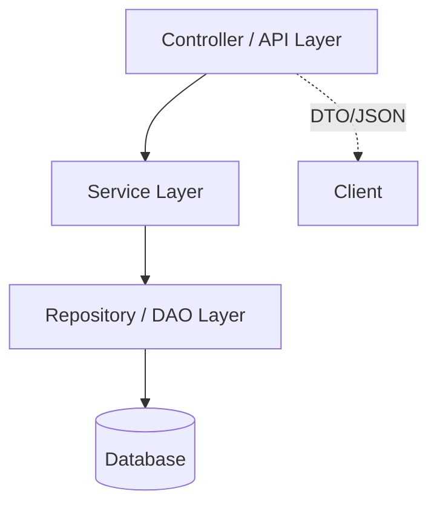

> 本文是配套实现文章《[Running a simple SpringBoot project from scratch](/posts/Running-a-SpringBoot-project-from-scratch/)》的概念篇，聚焦 Spring Boot 及其相关技术的核心原理与最佳实践。如果你只想看如何一步步实现 CRUD，请跳转到实现篇；如果想系统理解背后的理念，请继续阅读。

## 1. 什么是 Spring Boot?
Spring Boot 通过“约定优于配置”与自动装配机制，帮助我们快速构建生产级 Spring 应用：

核心特色：
1. Auto-Configuration: 根据 classpath 自动推断并配置常用组件。
2. Starter 依赖：组合常用依赖，减少手工版本管理。
3. 内嵌服务器：打包成可执行 JAR，直接运行 (Tomcat / Jetty / Undertow)。
4. Actuator: 内置健康检查、指标、端点监控。
5. 微服务友好：与 Spring Cloud 无缝集成（配置中心、注册发现、熔断等）。

## 2. 分层架构概览
典型 Web/服务端应用按关注点划分为：Controller (API) → Service (业务) → Repository (数据访问) → Database。



### 2.1 Controller 层
职责：暴露 REST 接口、参数绑定、调用 Service、返回统一响应。遵循资源导向的 URL 设计与 HTTP 方法语义。

REST 约定：
- 资源命名用名词：/students, /orders/{id}
- HTTP 动词语义：GET(查), POST(增), PUT(覆写式更新), PATCH(部分更新), DELETE(删)
- 无状态：每个请求独立；身份通常靠 Token / Cookie / Header。

### 2.2 Service 层
职责：业务编排、验证、事务边界、聚合多个 Repository 结果；不关心 HTTP / 序列化细节。

### 2.3 Repository 层
职责：面向持久化的抽象；通过 Spring Data JPA 屏蔽样板 CRUD，专注方法语义。

### 2.4 Database / Persistence
持久化 = 数据长期可靠保存。JPA/Hibernate 作为 ORM 桥接对象模型与关系模型。

## 3. RESTful 设计补充
良好 API 需要：清晰资源边界、一致命名、合理状态码、幂等性。

常用状态码：200 OK / 201 Created / 204 No Content / 400 Bad Request / 404 Not Found / 409 Conflict / 500 Internal Server Error。

版本化策略：/api/v1/... 或 Accept: application/vnd.demo.v1+json。

## 4. JPA 核心注解速览

| 注解            | 作用         | 关键属性                         | 说明                     |
| --------------- | ------------ | -------------------------------- | ------------------------ |
| @Entity         | 声明实体     | name                             | 需有无参构造；避免 final |
| @Table          | 自定义表映射 | name, uniqueConstraints, indexes | 名称相同可省略           |
| @Id             | 主键         | —                                | 一个实体唯一主键         |
| @GeneratedValue | 主键生成策略 | strategy, generator              | 需与数据库能力匹配       |
| @Column         | 字段映射     | name, nullable, length, unique   | 可省略，默认字段名       |

实践要点：
- 可空字段用包装类型 (Long / Integer / Boolean)。
- 避免在实体放业务逻辑或跨层 DTO 逻辑。
- equals/hashCode 只用稳定业务键或使用主键生成后再参与；谨慎 @Data。

### 4.1 Lombok @Data 风险
@Data 生成的 equals/hashCode/toString 可能触发懒加载或循环引用；建议用 @Getter/@Setter + 自定义必要方法。

## 5. 主键 (ID) 生成策略对比

| 策略        | 机制       | 适用              | 优点       | 缺点            |
| ----------- | ---------- | ----------------- | ---------- | --------------- |
| IDENTITY    | DB 自增    | MySQL 等          | 简单       | 批量插入性能差  |
| SEQUENCE    | 序列对象   | PostgreSQL/Oracle | 预取批量好 | 需序列          |
| AUTO        | 供应商决定 | 通用              | 配置少     | 跨库不确定      |
| TABLE       | 模拟表     | 任何              | 兼容性     | 额外表 + 锁竞争 |
| UUID/自定义 | 应用生成   | 分布式            | 不依赖 DB  | 索引大/随机写   |

选择建议：MySQL 用 IDENTITY 或雪花/ULID；PostgreSQL 用 SEQUENCE + allocationSize；分布式/跨服务追踪用全局 ID。

常见问题：

| 现象               | 原因                   | 解决                        |
| ------------------ | ---------------------- | --------------------------- |
| Identifier missing | 缺 @Id                 | 添加注解                    |
| Wrong strategy     | e.g. MySQL 用 SEQUENCE | 换成 IDENTITY               |
| 批量慢             | IDENTITY 阻塞          | 改 SEQUENCE / 应用侧生成    |
| UUID 索引膨胀      | 无序随机               | 使用 ULID / time-based UUID |

### 5.1 示例代码
```java
// MySQL 自增
@Id
@GeneratedValue(strategy = GenerationType.IDENTITY)
private Long id;

// PostgreSQL 序列
/*
@Id
@SequenceGenerator(name = "student_seq", sequenceName = "student_seq", allocationSize = 1)
@GeneratedValue(strategy = GenerationType.SEQUENCE, generator = "student_seq")
private Long id;
*/

// Hibernate 6+ UUID
/*
@Id
@GeneratedValue(strategy = GenerationType.UUID)
private java.util.UUID id;
*/
```
> 提示：批量写入高性能需求下避免 IDENTITY，可考虑 SEQUENCE (PostgreSQL) 或应用侧（雪花/ULID）生成。

## 6. Repository 方法派生 (Query Method Derivation)
命名规则：find + [限定] + By + 条件(字段 + 运算符) + (And/Or ...)。
支持关键词：Between / Like / In / True / False / IsNull / GreaterThan / OrderBy...
返回类型：实体 / Optional / List / Page / Slice / Stream。
复杂查询：@Query / Specification / QueryDSL / 原生 SQL。

## 7. DTO 与实体分离
原因：隐藏内部字段；避免懒加载异常；做聚合/裁剪；方便版本演进。建议 Controller 只暴露 DTO，内部用 MapStruct / 手写转换。

## 8. 常见最佳实践 & 易踩坑

最佳实践：
- 读写分离逻辑放 Service，不在 Controller 里堆业务判断。
- 对唯一约束（如 email）显式预校验，而不是靠数据库异常再捕获。
- 高频查询列建索引（email, active）。
- 事务边界：写操作加 @Transactional；只读大量查询可 @Transactional(readOnly = true)。

坑位与规避：

| 问题             | 风险                        | 规避                |
| ---------------- | --------------------------- | ------------------- |
| 原始类型字段     | 无法表示 NULL               | 用包装类型          |
| 直接序列化实体   | LazyInitializationException | 转 DTO 或限制 fetch |
| 滥用 @Data       | 性能/栈溢出                 | 精准注解            |
| 业务逻辑写在实体 | 难测试/事务混乱             | 放 Service          |

## 9. 事务 (Transaction) 基础
Spring 声明式事务通过 AOP 代理拦截 public 方法，启动/提交/回滚。默认 RuntimeException 回滚，可通过 @Transactional(rollbackFor=Exception.class) 扩展。

注意：同类内部方法调用不会触发代理，需拆分或使用 self-injection。

## 10. 进一步阅读
- 官方文档：https://docs.spring.io/spring-boot/docs/current/reference/html/
- Spring Data JPA：https://docs.spring.io/spring-data/jpa/docs/current/reference/html/
- REST 设计：https://restfulapi.net/

---
返回实现篇： [Running a simple SpringBoot project from scratch](/posts/Running-a-SpringBoot-project-from-scratch/)
