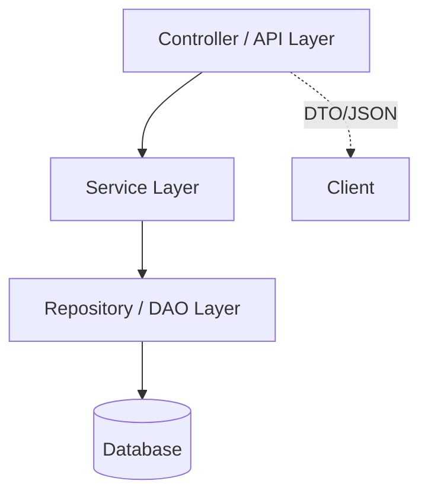

> 本文是配套实现文章《[Running a simple SpringBoot project from scratch](/posts/Running-a-SpringBoot-project-from-scratch/){:target="_blank" }》的概念篇，聚焦 Spring Boot 及其相关技术的核心原理与最佳实践。

## 1. 什么是 Spring Boot?
Spring Boot 通过“约定优于配置”(Convention over configuration) 与自动装配 (Autoconfiguration) 机制，帮助我们快速构建生产级 Spring 应用：

核心特色：
1. Auto-Configuration: 根据 classpath 自动推断并配置常用组件。
2. Starter 依赖：组合常用依赖，减少手工版本管理。
3. 内嵌服务器：打包成可执行 JAR，直接运行 (Tomcat / Jetty / Undertow)。
4. Actuator: 内置健康检查、指标、端点监控。
5. 微服务友好：与 Spring Cloud 无缝集成（配置中心、注册发现、熔断等）。

## 2. 分层架构概览
典型 Web/服务端应用按关注点划分为：Controller (API) → Service (业务) → Repository (数据访问) → Database。



### 2.1 Controller 层
职责：暴露 REST 接口、参数绑定、调用 Service、返回统一响应。遵循资源导向的 URL 设计与 HTTP 方法语义。

REST 约定：
- 资源命名用名词，如：`/students`, `/orders/{id}`
- HTTP 动词语义：
  - `GET` (查): 获取资源。安全（不应有副作用）且幂等（多次请求效果一致）。
  - `POST` (增): 创建新资源。非幂等。
  - `PUT` (覆写式更新): 完整替换一个资源。幂等。
  - `PATCH` (部分更新): 对资源进行局部修改。通常非幂等。
  - `DELETE` (删): 删除资源。幂等。
- 无状态：每个请求独立；身份通常靠 Token / Cookie / Header。

### 2.2 Service 层
职责：业务编排、验证、事务边界、聚合多个 Repository 结果；不关心 HTTP / 序列化细节。

### 2.3 Repository 层
职责：面向持久化的抽象；通过 Spring Data JPA 屏蔽样板 CRUD，专注方法语义。

### 2.4 Database / Persistence
持久化 = 数据长期可靠保存。JPA/Hibernate 作为 ORM 桥接对象模型与关系模型。

## 3. RESTful 设计
REST (Representational State Transfer) 是一种用于设计网络应用的架构风格，而非一种标准。一个符合 REST 风格的 API 被称为 RESTful API。它强调通过一组统一的、预定义的无状态操作来操作资源。

### 3.1 什么是 URI？
URI (Uniform Resource Identifier) 是一个用于唯一标识互联网上资源的字符串。它就像是网络上每个资源的“地址”或“身份证号”。URI 分为 URL 和 URN 两种。

- **URL (Uniform Resource Locator)**: 是我们最常见的形式，它不仅标识了资源，还提供了找到该资源的方法（即位置）。例如 `https://api.example.com/students/1`。
- **URN (Uniform Resource Name)**: 它通过一个唯一的名称来标识资源，但不指定如何找到它。例如 `urn:isbn:0451450523`。

在 Web 开发和 REST API 设计中，我们通常使用的都是 URL。一个典型的 URL 结构如下：

`scheme://host:port/path?query#fragment`

- **Scheme**: 定义了访问资源的协议，如 `http`, `https`。
- **Host**: 资源所在的服务器域名或 IP 地址，如 `api.example.com`。
- **Port**: 服务器上监听请求的端口号，`http` 默认为 80，`https` 默认为 443。
- **Path**: 资源在服务器上的具体路径，如 `/students/1`。这是 REST API 设计中定义资源层次结构的核心部分。
- **Query**: 提供额外的参数，用于过滤或分页，以 `?` 开始，键值对用 `&` 分隔，如 `?page=1&size=10`。
- **Fragment**: 指向资源内部的一个部分，以 `#` 开始。在 REST API 中较少使用。

在 RESTful API 中，Path 部分 (`/students/1`) 用于唯一标识一个资源（例如 ID 为 1 的学生），而 Query 部分 (`?active=true`) 则用于对资源集合进行筛选。

### 3.2 核心原则
1.  **客户端-服务器 (Client-Server)**：分离用户界面和数据存储，提高可移植性和可伸缩性。
2.  **无状态 (Stateless)**：服务器不保存客户端的会话状态。每个请求都必须包含所有必要信息。
3.  **可缓存 (Cacheable)**：响应应明确标识自己是否可缓存，以提高性能。
4.  **统一接口 (Uniform Interface)**：这是 REST 的核心，包含以下几个方面：
    - **资源标识**：通过 URI (如 `/students/123`) 唯一标识资源。
    - **通过表述操作资源**：客户端通过资源的表述（如 JSON 或 XML）来操作资源，而不是直接操作。
    - **自描述消息**：每个消息都包含足够的信息来描述如何处理它（例如，通过 `Content-Type` 头指定媒体类型）。
    - **HATEOAS (Hypermedia as the Engine of Application State)**：响应中应包含链接，指引客户端可以执行的下一步操作。例如，获取一个订单的响应可以包含取消或更新该订单的链接。

### 3.3 设计要点
良好 API 需要：清晰资源边界、一致命名、合理状态码、幂等性。

**常用状态码**：`200 OK` / `201 Created` / `204 No Content` / `400 Bad Request` / `404 Not Found` / `409 Conflict` / `500 Internal Server Error`。

**版本化策略**：
- **URI(Uniform Resource Identifier) 版本化**: 将版本号直接嵌入 URI 中，例如 `/api/v1/students`。这种方式直观，易于在浏览器中测试，但有观点认为它破坏了 URI 作为资源唯一标识的纯粹性。
  
  **示例：** 客户端请求 v1 版本的学生信息。
  ```http
  GET /api/v1/students/1 HTTP/1.1
  Host: api.example.com
  ```
  如果需要 v2 版本，URI 会变为 `/api/v2/students/1`。

- **Header 版本化**: 客户端通过 HTTP `Accept` 头请求特定版本的资源表述，例如 `Accept: application/vnd.demo.v1+json`。这种方式保持 URI 的纯净（URI 不变），将版本信息作为资源“表述”的一部分，更符合 REST 理念。
  
  **示例：** 客户端请求 v1 版本的学生信息。服务器会检查 `Accept` 头来决定返回哪个版本的响应。
  ```http
  GET /students/1 HTTP/1.1
  Host: api.example.com
  Accept: application/vnd.demo.v1+json
  ```
  如果客户端想请求 v2，只需改变 `Accept` 头为 `application/vnd.demo.v2+json`，URI (`/students/1`) 保持不变。

## 4. JPA 核心注解速览

| 注解            | 作用         | 关键属性                         | 说明                     |
| --------------- | ------------ | -------------------------------- | ------------------------ |
| @Entity         | 声明实体     | name                             | 需有无参构造；避免 final |
| @Table          | 自定义表映射 | name, uniqueConstraints, indexes | 名称相同可省略           |
| @Id             | 主键         | —                                | 一个实体唯一主键         |
| @GeneratedValue | 主键生成策略 | strategy, generator              | 需与数据库能力匹配       |
| @Column         | 字段映射     | name, nullable, length, unique   | 可省略，默认字段名       |

实践要点：
- 可空字段用包装类型 (Long / Integer / Boolean)。
- 避免在实体放业务逻辑或跨层 DTO 逻辑。
- equals/hashCode 只用稳定业务键或使用主键生成后再参与；谨慎 @Data。

### 4.1 Lombok `@Data` 风险
`@Data` 生成的 `equals/hashCode/toString` 可能触发懒加载或循环引用；建议用 `@Getter/@Setter` + 自定义必要方法。

## 5. 主键 (ID) 生成策略对比

| 策略        | 机制       | 适用              | 优点       | 缺点            |
| ----------- | ---------- | ----------------- | ---------- | --------------- |
| IDENTITY    | DB 自增    | MySQL 等          | 简单       | 批量插入性能差  |
| SEQUENCE    | 序列对象   | PostgreSQL/Oracle | 预取批量好 | 需序列          |
| AUTO        | 供应商决定 | 通用              | 配置少     | 跨库不确定      |
| TABLE       | 模拟表     | 任何              | 兼容性     | 额外表 + 锁竞争 |
| UUID/自定义 | 应用生成   | 分布式            | 不依赖 DB  | 索引大/随机写   |

选择建议：MySQL 用 IDENTITY 或雪花/ULID;  
PostgreSQL 用 SEQUENCE + allocationSize;  
分布式/跨服务追踪用全局 ID。

常见问题：

| 现象               | 原因                   | 解决                        |
| ------------------ | ---------------------- | --------------------------- |
| Identifier missing | 缺 @Id                 | 添加注解                    |
| Wrong strategy     | e.g. MySQL 用 SEQUENCE | 换成 IDENTITY               |
| 批量慢             | IDENTITY 阻塞          | 改 SEQUENCE / 应用侧生成    |
| UUID 索引膨胀      | 无序随机               | 使用 ULID / time-based UUID |

### 5.1 示例代码
```java
// MySQL 自增
@Id
@GeneratedValue(strategy = GenerationType.IDENTITY)
private Long id;

// PostgreSQL 序列
/*
@Id
@SequenceGenerator(name = "student_seq", sequenceName = "student_seq", allocationSize = 1)
@GeneratedValue(strategy = GenerationType.SEQUENCE, generator = "student_seq")
private Long id;
*/

// Hibernate 6+ UUID
/*
@Id
@GeneratedValue(strategy = GenerationType.UUID)
private java.util.UUID id;
*/
```
> 批量写入高性能需求下避免 IDENTITY，可考虑 SEQUENCE (PostgreSQL) 或应用侧（雪花/ULID）生成。
{: .prompt-tip}

## 6. Repository 方法派生 (Query Method Derivation)
命名规则：`find + [限定] + By + 条件(字段 + 运算符) + (And/Or ...)`。  
支持关键词：`Between` / `Like` / `In` / `True` / `False` / `IsNull` / `GreaterThan` / `OrderBy...`  
返回类型：实体 / `Optional` / `List` / `Page` / `Slice` / `Stream`。  
复杂查询：`@Query` / `Specification` / `QueryDSL` / 原生 SQL。

<!-- Some examples -->
```java
// 简单查询
Optional<Student> findByEmail(String email);
List<Student> findByActiveTrueOrderByCreatedAtDesc();
Page<Student> findByLastName(String lastName, Pageable pageable);
// 复杂查询
@Query("SELECT s FROM Student s WHERE s.age > :age")
List<Student> findOlderThan(@Param("age") int age); // @Param 可省略，参数名需与占位符一致
```

## 7. DTO 与实体分离
原因：隐藏内部字段；避免懒加载异常；做聚合/裁剪；方便版本演进。  
建议 Controller 只暴露 DTO，内部用 `MapStruct` / 手写转换。
Example DTO:
```java
public class StudentDTO {
    private Long id;
    private String firstName;
    private String lastName;
    private String email;
    // 省略 getter/setter
}
```


## 8. 常见最佳实践 & 易踩坑

最佳实践：
- 读写分离逻辑放 Service，不在 Controller 里堆业务判断。
- 对唯一约束（如 email）显式预校验，而不是靠数据库异常再捕获。
  ```java
  // StudentService.java
  public Student createStudent(StudentCreateDTO dto) {
      // 预校验 email 是否已存在
      if (studentRepository.findByEmail(dto.getEmail()).isPresent()) {
          // 抛出自定义异常或返回错误信息，而不是等待数据库抛出 ConstraintViolationException
          throw new EmailAlreadyExistsException("Email " + dto.getEmail() + " is already taken.");
      }
      // ... 转换 DTO 为实体并保存
  }
  ```
- 高频查询列建索引（email, active）。通过 `@Table` 注解在实体上声明索引，JPA 提供商（如 Hibernate）会在生成 DDL 时创建它们。
  ```java
  // Student.java
  @Entity
  @Table(name = "students", indexes = {
      @Index(name = "idx_student_email", columnList = "email", unique = true),
      @Index(name = "idx_student_active_created", columnList = "active, createdAt")
  })
  public class Student {
      // ...
      @Column(nullable = false)
      private String email;
  
      private boolean active;

      private Instant createdAt;
      // ...
  }
  ```
- 事务边界：写操作加 `@Transactional`；只读大量查询可 `@Transactional(readOnly = true)`。

| 问题             | 风险                        | 规避                |
| ---------------- | --------------------------- | ------------------- |
| 原始类型字段     | 无法表示 NULL               | 用包装类型          |
| 直接序列化实体   | LazyInitializationException | 转 DTO 或限制 fetch |
| 滥用 @Data       | 性能/栈溢出                 | 精准注解            |
| 业务逻辑写在实体 | 难测试/事务混乱             | 放 Service          |

## 9. 事务 (Transaction) 基础
Spring 声明式事务通过 **AOP (Aspect-Oriented Programming)** 代理拦截 public 方法，启动/提交/回滚。AOP 是一种编程范式，它允许我们将横切关注点（如事务、日志、安全）与业务逻辑分离，从而提高模块化程度。

当一个方法被 `@Transactional` 注解时，Spring 在运行时会为该 Bean 创建一个代理对象。这个代理在调用实际方法前后，会插入事务管理的逻辑。

**示例：AOP 如何工作（概念）**
```java
// 1. 你的业务代码
@Service
public class StudentService {
    @Transactional
    public void updateStudentEmail(Long studentId, String newEmail) {
        // ... 业务逻辑：查找学生并更新邮箱
    }
}

// 2. Spring 在运行时生成的代理（概念上的伪代码）
public class StudentServiceProxy extends StudentService {
    private StudentService target; // 原始的 StudentService 实例
    private PlatformTransactionManager transactionManager;

    @Override
    public void updateStudentEmail(Long studentId, String newEmail) {
        // 1. 开始事务
        TransactionStatus status = transactionManager.getTransaction(new DefaultTransactionDefinition());
        try {
            // 2. 调用原始对象的业务方法
            target.updateStudentEmail(studentId, newEmail);
            // 3. 如果没有异常，提交事务
            transactionManager.commit(status);
        } catch (RuntimeException e) {
            // 4. 如果出现运行时异常，回滚事务
            transactionManager.rollback(status);
            throw e;
        }
    }
}
```

默认 `RuntimeException` 回滚，可通过 `@Transactional(rollbackFor=Exception.class)` 扩展。

注意：同类内部方法调用不会触发代理，需拆分或使用 self-injection。因为内部调用 `this.someMethod()` 不会经过代理对象，所以 AOP 逻辑（如事务）不会被应用。

## 10. 进一步阅读
- 官方文档：[Spring Boot Documentation](https://docs.spring.io/spring-boot/docs/current/reference/html/){:target="_blank" }
- Spring Data JPA：[Spring Data JPA Documentation](https://docs.spring.io/spring-data/jpa/docs/current/reference/html/){:target="_blank" }
- REST 设计：[RESTful API Design](https://restfulapi.net/){:target="_blank" }

---

返回实现篇： [Running a simple SpringBoot project from scratch](/posts/Running-a-SpringBoot-project-from-scratch/){:target="_blank" }
